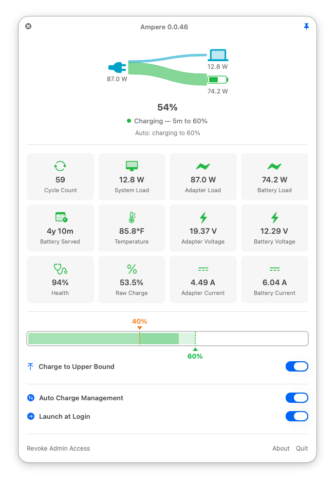

# Ampere

A lightweight macOS menu bar app for monitoring battery status and controlling charging on Apple Silicon Macs.

<p align="center">
  
</p>

## Features

- **Real-time battery stats** - percentage, cycle count, health, temperature, raw charge, and battery age, plus wattage (adapter / battery / system), voltage (adapter / battery), and current (adapter / battery)
- **Charge control** - pause and resume charging via SMC
- **Auto charge** - configurable upper/lower bounds to keep your battery in an optimal charge range
- **Micro-charge prevention** - inhibits charging between bounds after restart; only charges from below the lower bound or on explicit user request
- **Sleep-safe charging** - an in-progress charge never overshoots the upper bound while the Mac sleeps: between the bounds it pauses just before sleep and resumes on wake; below the lower bound the Mac is kept awake until the charge completes
- **Charge to upper bound** - explicitly allow charging from the current level to the upper bound
- **Charge to full** - one-shot full charge without touching the configured bounds; normal management resumes when full
- **Discharge to upper bound** - optionally drain the battery to the target level while on AC power
- **Health check** - periodically verifies SMC state matches expected values
- **In-app updates** - checks the Homebrew cask for new versions about once a day; a small blue badge dot on the menu bar icon signals a pending update, and clicking **Update to X** in the panel downloads, verifies, installs, and relaunches
- **Menu bar icon** - battery shape with live charge level and animated fill when charging or discharging; hovering it shows the current charge and status (e.g. "85% — Charging — 32m to 80%"); the percent readout beside it can be hidden (Settings → Percent in Menu Bar) for a narrower menu bar footprint
- **Pinnable popover** - pin the panel to keep it open while you work
- **Launch at login** - start automatically when you log in
- **Registration** - register with an email and registration key, bound to this Mac; the panel shows "Unregistered" until then. The registration is re-verified against the license server about once a day — network failures never clear it — and can be deregistered from the panel to move the key to another Mac.

## Requirements

- macOS 14 (Sonoma) or later
- Apple Silicon Mac
- Admin privileges (for charge control features)

## Installation

### Homebrew (Recommended)

```bash
brew tap az-code-lab/taps
brew install --cask ampere
```

### Manual

Download the latest `.dmg` from the [GitHub Releases](https://github.com/az-code-lab/ampere/releases) page, open it, and drag **Ampere.app** to your Applications folder.

## Usage

### Charge Control

Pausing/resuming charging requires root access to write to the SMC. Ampere handles this as follows:

1. **On launch** - the app installs (or updates) its helper binary. If the helper is missing or outdated, macOS prompts for your admin password. If cancelled, the app exits.
2. **Setup** - a compiled helper binary (`SMCWriter`) is installed at `/usr/local/bin/az-ampere-smc` (owned by root), along with a sudoers rule at `/etc/sudoers.d/az-ampere` that allows passwordless execution of the helper. The rule is pinned to the helper's SHA-256 digest, so sudo refuses to run a swapped or tampered binary at that path.
3. **Subsequent launches** - the helper is verified at startup. If unchanged, no password is needed. After a Homebrew upgrade, the new helper is installed automatically (one password prompt).

> **Note:** Admin access is granted per macOS user account — the sudoers rule names the account that installed it. If another account on the same Mac grants access, the rule is rewritten for that account, and the first account will be prompted for its password again on its next launch.

### Auto Charge

When enabled, the app automatically manages charging between configurable bounds:

- **Below lower bound** - starts charging, continues until the upper bound is reached
- **Between bounds** - holds (charging inhibited); use **Charge to Upper Bound** to explicitly start charging
- **Above upper bound** - inhibits charging; use **Discharge to Upper Bound** to actively drain to the target

#### Micro-Charge Prevention

To protect battery longevity, the app prevents unnecessary short charge cycles between bounds. When the charge level is between the lower and upper bounds, charging is inhibited by default — including after an app restart or crash. The only ways charging begins are:

1. The battery drops below the **lower bound** (automatic — charges all the way to the upper bound)
2. The user toggles **Charge to Upper Bound** (explicit — charges to the upper bound, then resets)

This ensures charge cycles are always full (lower → upper) rather than fragmented micro-charges.

#### Discharge to Upper Bound

When the battery is above the upper bound, this toggle appears. When enabled, the app actively discharges the battery down to the upper bound, rather than waiting for passive drain under load.

**Note:** While discharge is active, system sleep is temporarily disabled (displayed as a warning in the UI). Sleep is restored immediately when discharge stops (either by reaching the target or toggling off). If the app is force-killed or crashes, a watchdog daemon automatically cleans up within a few seconds.

When a discharge stops, the app explicitly re-writes the charging-inhibit key: on some Macs the firmware clears it while discharge is active, and without the re-write charging would silently resume past the upper bound.

#### Charge to Upper Bound

When the battery is between the lower and upper bounds and charging is inhibited, this toggle appears. When enabled, the app allows charging until the upper bound is reached, then automatically resets the toggle and re-inhibits charging. Toggling it off mid-charge stops charging immediately and re-inhibits.

#### Charge to Full

A one-shot full charge for days when you need maximum battery (e.g. heading out without a charger). The toggle appears in auto mode whenever a power adapter is connected and the battery is not already full. While active, the effective charge ceiling is 100%; the configured bounds are never modified, and the upper-bound dragger is hidden from the slider (the range highlight extends to 100% instead) since it has no effect until the charge completes. When the battery is full, the toggle clears itself, the dragger returns, and normal auto management resumes with your original bounds.

"Full" means the displayed percentage reaching 100% **or** the battery's own fully-charged signal, whichever comes first. Worn batteries can terminate their charge below a displayed 100%; the BMS signal completes the one-shot there instead of holding the charge state open forever.

The one-shot is tied to the current AC session:

- **Reaching full** clears it; charging is inhibited and the battery holds at full while plugged in (no top-up micro-charges).
- **Unplugging** cancels it. At or above the lower bound, a later reconnect parks at the current level as usual. Below the lower bound, the intent downgrades to **Charge to Upper Bound**, so a reconnect behaves exactly like the normal below-lower recovery.
- **Toggling it off** mid-charge re-inhibits immediately; the next cycle restores the default behavior for the current level.
- **Activating it turns Discharge to Upper Bound off** (the setting itself, not just temporarily): draining the battery right after an explicitly requested full charge is never desirable. Re-enable discharge manually if you still want it afterwards.

Like Charge to Upper Bound, the toggle is persisted: an in-progress full charge resumes across an app restart or crash.

#### Sleep and Mid-Charge Protection

The upper bound is enforced in software: a poll must observe the crossing and write the charging-inhibit key. While the Mac sleeps no polls run, but the SMC keeps charging whenever CHTE allows it — so a charge left running at sleep time would sail past the upper bound (seen in the field as "closed the lid charging to 50%, came back to 65%"). Two mechanisms close the gap:

- **Pre-sleep pause (at or above the lower bound).** macOS announces sleep to apps a few seconds before it happens. If a charge is running there, Ampere writes the inhibit inside that grace window and lets the Mac sleep; in-memory state is deliberately untouched, and the wake handler re-asserts "allow" for unpaused states, so the charge resumes on wake and finishes at the upper bound. The announcement cannot be refused, only reacted to — which is why the below-lower case needs the second mechanism.

- **Sleep hold (below the lower bound).** A charge that starts below the lower bound keeps the Mac awake until the upper bound is reached (`pmset -a sleep 0 disablesleep 1` via the helper — the same override discharge uses, minus the display-sleep part, so the screen still sleeps). Pausing such a charge at sleep would strand the battery below the range all night; charging through sleep would overshoot; holding the Mac awake is the only outcome that ends inside the range. A lid close during the hold is simply absorbed — the sleep never initiates. Once the battery climbs past the lower bound, the hold persists only while the lid stays closed (the evidence that a sleep was absorbed); with the lid open it releases, and the pre-sleep pause covers any later sleep attempt. While active it shows the same orange "sleep is disabled" warning as discharge. It is released by reaching the upper bound, unplugging, disabling auto charge, quitting — or, after a crash, by the watchdog through the persistent pmset markers. The hold intent is persisted, so a restart mid-charge (including an in-app upgrade with the lid closed) re-arms it.

- **Charge to Full is exempt.** Its ceiling is 100%, so a sleeping Mac cannot overshoot it, and charging through the night is the point of the feature.

Residual gaps, by design: plugging in a Mac that is *already asleep* charges it with no app awake to manage the bounds, and a crash mid-hold restores system defaults (charging allowed, sleep restored). Both are corrected the next time the app runs a poll — at wake or relaunch — where the standard above-upper handling (inhibit, plus discharge-to-upper if enabled) takes over.

### Manual Charge Control

When auto charge is off and a power adapter is connected, a manual **Pause Charging** / **Resume Charging** button is available.

### Behavior on Sleep/Wake and Quit/Restart

| Scenario | Sleep → Wake | Quit → Restart |
|---|---|---|
| **Charge to Upper Bound** is ON (charging in progress between bounds) | **The charge pauses just before sleep and resumes on wake.** The sleep announcement handler writes CHTE=inhibit (in-memory state untouched); on wake the handler re-asserts CHTE per the current state — "allow" here, since the state still says an unpaused charge is running — and the charge finishes at the upper bound. A charge that began *below the lower bound* doesn't sleep at all: the sleep hold keeps the Mac awake until the upper bound (see Sleep and Mid-Charge Protection). Toggle stays ON until the upper bound is reached. | **Charging resumes automatically.** The "Charge to Upper Bound" toggle is persisted across restart so an in-progress charge resumes rather than parking at the current level. On launch the app sees `chargeToUpperBound = true` and leaves CHTE in the "allow" state; charging continues until the upper bound is reached, at which point the toggle clears itself. |
| **Charge to Full** is ON (one-shot full charge in progress) | Charging continues through sleep — the ceiling is 100%, so there is nothing to overshoot, and the pre-sleep pause deliberately skips this state. The wake handler re-runs the state machine, which keeps CHTE in "allow" until the battery is full. Toggle stays ON until full. | **Charging resumes automatically.** The toggle is persisted; on launch the app skips the between-bounds inhibit and leaves CHTE in "allow", so the full charge continues (even past the configured upper bound) until full, where the toggle clears itself. A launch that finds the flag set but the Mac on battery clears it, because the one-shot is tied to the AC session it was started in. |
| **Discharge to Upper Bound** is ON (discharging above upper bound) | Discharging continues. System sleep is prevented during discharge, so normal sleep should not occur. If forced (e.g. lid close), the wake handler re-asserts the discharge SMC state. Toggle stays ON. | **Discharging resumes automatically.** The "Discharge to Upper Bound" toggle is persisted. On restart, the app clears stale SMC state, then the first refresh cycle detects the battery is still above the upper bound and restarts discharge. Toggle stays ON. |

### Settings and Safety

- **Settings persist across restarts** - auto charge, discharge toggle, and charge bounds are saved and restored when the app relaunches.
- **Quitting the app restores system defaults** - all SMC overrides (charging inhibit, discharge) and power management changes (sleep settings) are cleared when the app exits. Your Mac returns to its normal charging and sleep behavior. If the app crashes or is force-killed, a watchdog daemon cleans up automatically within a few seconds.

### Health Check

The app periodically verifies that the actual SMC key values (`CHTE` and `CHIE`) match the expected state. If a mismatch is detected, a warning is shown in the popover and the menu bar battery icon turns orange.

Health checks only run while a power adapter is connected — on battery the app is not managing charging, so there is no expected SMC state to verify. Until the first check of a session has run, the About panel shows the check as **waiting for power adapter** (on battery) or **pending** (plugged in, during the warm-up below).

#### Polling and Health Check Timing

The app polls battery state on a timer. Health checks run every poll cycle after an initial 3-cycle warm-up (to let launch cleanup settle), whenever a power adapter is connected.

|  | Popover closed (slow) | Popover open (fast) |
|---|---|---|
| **First poll** | Immediately on launch | Immediately on open |
| **Poll interval** | 60s | 10s |
| **First health check** | Cycle 4 — 3 min after launch | Cycle 4 — ~30s after open* |
| **Health check interval** | Every cycle — 60s | Every cycle — 10s |

\* The cycle counter is global and does not reset when switching between fast and slow polling. If the app has already been running, the first health check after opening the popover depends on the current cycle count.

Health checks also run immediately after revoking admin access, and after re-granting it from inside the app (when enabling a charge-control feature reinstalls the helper), so the warning clears (or appears) without waiting for the next scheduled check. After an app relaunch — including the revoke → relaunch → re-grant flow — the first check follows the normal warm-up schedule above.

### Updates

The app checks the Homebrew cask for a newer version 5 minutes after launch and about once a day after that. When one is found, the menu bar battery icon gains a small blue badge dot (hover for the version; the dot renders alongside the orange health-warning tint when both apply) and the panel footer shows an **Update to X** button. Clicking it:

1. Downloads the release DMG from GitHub Releases (progress shown in the footer).
2. Verifies the download: SHA-256 must match the cask, the code signature must be intact, and the Team ID must match the running app.
3. Swaps the new bundle into place (two atomic renames) and relaunches.

The relaunch takes the normal quit → restart path: SMC overrides are restored on the way down, and persisted state (auto charge, bounds, an in-progress charge/discharge to upper bound) resumes in the new copy. If the bundled SMCWriter changed, the next launch asks for your admin password once to install the new helper — same as after a Homebrew upgrade.

If any step fails (e.g. the install location isn't writable), the error is shown next to the button and nothing is changed; `brew upgrade --cask ampere` always works as a fallback. Updating in-app leaves Homebrew's recorded version behind until the next `brew upgrade`, which harmlessly reinstalls the current release.

## Build from Source

```bash
./run.sh
```

Or manually:

```bash
swift build -c debug
.build/debug/Ampere
```

## Uninstall

### Remove the app

```bash
brew uninstall ampere
```

Or delete `Ampere.app` from Applications.

### Remove SMCWriter and admin access

Charge control installs privileged files that persist after the app is deleted:

- `/usr/local/bin/az-ampere-smc` - the SMCWriter helper binary (runs as root to write SMC keys)
- `/etc/sudoers.d/az-ampere` - the sudoers rule that allows passwordless execution of the helper
- `/Library/Application Support/az-ampere/` - state directory for the saved-sleep markers (only exists if discharge was ever used)

**From the UI:** Click **Settings** in the panel footer, then **Revoke** on the Admin Access row. This removes all of them (prompts for your admin password).

**From the command line:**

```bash
sudo rm -f /usr/local/bin/az-ampere-smc
sudo rm -f /etc/sudoers.d/az-ampere
sudo rm -rf '/Library/Application Support/az-ampere'
```

## Troubleshooting

**"Pause Charging" does nothing / no password prompt appears**

The helper binary may be corrupted. Fix by revoking and re-granting access:

1. Click **Settings** in the panel footer, then **Revoke** on the Admin Access row
2. Relaunch the app - it will prompt for your password and install a fresh helper

---

## Technical Details

This section documents the implementation details of SMC-based charge control and discharge, including the problems encountered and their solutions.

### SMC Keys

| Key | Type | Description |
|------|------|-------------|
| `CHTE` | `ui32` (4 bytes) | Charge terminate / inhibit. `0x01 00 00 00` paused, `0x00 00 00 00` allowed. |
| `CHIE` | `hex_` (1 byte) | Charge inhibit enable / discharge. `0x08` discharge, `0x00` normal. |

#### Manual Mode

| Pause button | Expected CHTE | Expected CHIE |
|---|---|---|
| Paused | `0x01 00 00 00` | `0x00` |
| Resumed | `0x00 00 00 00` | `0x00` |

#### Auto Mode — Discharge to Upper Bound OFF

| Charge level | Expected CHTE | Expected CHIE |
|---|---|---|
| >= upper bound | `0x01 00 00 00` | `0x00` |
| >= lower bound and < upper bound | `0x00 00 00 00` or `0x01 00 00 00` | `0x00` |
| < lower bound | `0x00 00 00 00` | `0x00` |

While **Charge to Full** is active, this table applies with the upper bound read as 100 and CHTE expected to be `0x00 00 00 00` (allow) everywhere below it. (Discharge is always off in that state — activating the one-shot disables it.) For any 100% target, the battery's `FullyCharged` flag counts as "at the bound", covering worn batteries that terminate below a displayed 100%.

#### Auto Mode — Discharge to Upper Bound ON

| Charge level | Expected CHTE | Expected CHIE |
|---|---|---|
| > upper bound | `0x01 00 00 00` | `0x08` |
| >= lower bound and <= upper bound | `0x00 00 00 00` or `0x01 00 00 00` | `0x00` |
| < lower bound | `0x00 00 00 00` | `0x00` |

Both keys are written via IOKit's `IOConnectCallStructMethod` (selector 2) to the `AppleSMCKeysEndpoint` service (falling back to `AppleSMC`). Writing requires root privileges. Reading does not require root.

The helper binary (`SMCWriter`) is a minimal executable with no AppKit/SwiftUI dependencies. It is root-owned and not user-writable.

### Clamshell Mode and the Black Screen Problem

Writing `CHIE = 0x08` triggers a USB-C Power Delivery (PD) renegotiation, which briefly disrupts the display signal on the Thunderbolt/USB-C port. This causes a specific problem in **clamshell mode** (lid closed with external monitors):

1. The CHIE write causes a momentary display disconnect.
2. macOS detects "no displays available" and triggers clamshell sleep.
3. External monitors go permanently black until the lid is opened.

With the lid open, the internal display keeps the system awake through the brief PD disruption, so external monitors reconnect immediately.

#### Approaches that didn't work

| Approach | Result |
|----------|--------|
| `caffeinate -dis` (power assertions) | Assertions don't prevent PD-triggered clamshell sleep |
| `IOPMAssertionCreateWithName` (from root and GUI processes) | Same — assertions insufficient for hardware-level PD events |
| `IORegistryEntrySetCFProperty` / `IOConnectSetCFProperty` on `IOPMrootDomain` | Permission denied on Apple Silicon (`kIOReturnUnsupported`) |
| Writing `CH0R` instead of `CHIE` | No blackout, but doesn't actually enable discharge |
| Signal handlers (`SIGTERM`/`SIGHUP`) for cleanup in persistent process | Swift runtime is not async-signal-safe; cleanup code crashed |
| `fork()` to daemonize the watchdog | Swift/ObjC runtime is not fork-safe; child process crashed |

#### Solution

**`pmset -a sleep 0 disablesleep 1 displaysleep 0`** before the CHIE write. This disables all system sleep at the OS level, preventing macOS from sleeping during the PD disruption.

Because the `-a` override stamps **all** power profiles, the original `sleep` and `displaysleep` values are captured per profile (Battery and AC, from `pmset -g custom`) before the override, and restored per profile (`pmset -b` / `pmset -c`) when discharge stops — a user with different battery-vs-AC sleep settings gets both back exactly. If the originals cannot be captured (pmset unreadable, marker unwritable), the discharge refuses to start rather than override sleep with no way to restore it.

The saved values live in `/Library/Application Support/az-ampere/saved-sleep` (and `saved-sleep-display`). The markers deliberately live outside `/tmp`: macOS wipes `/tmp` at boot while `pmset -a` overrides persist across reboots, so a crash + reboot during discharge would otherwise lose the saved values and leave sleep permanently disabled. With the persistent markers, the next launch's cleanup finds them and restores the original settings. (Single-value markers written by older builds — including to the legacy `/tmp` location — are still honored; their one value is applied to both profiles, matching what those builds' `-a` restore did.)

The mid-charge **sleep hold** (see Sleep and Mid-Charge Protection) saves and restores through the same markers via the `hold-sleep` / `release-sleep-hold` helper commands, so every existing restore path — `nodischarge`, the watchdog, launch cleanup — undoes it too. The hold's override is `sleep 0 disablesleep 1` only (no `displaysleep 0`: there is no CHIE write and no PD renegotiation to protect against, so the display may sleep while the machine charges). Both keys' markers are still saved, because the shared restore always puts back both.

### Watchdog Daemon

A **watchdog daemon** is always running while the app is active. It is spawned via `posix_spawn` on launch, re-spawned after discharge stops, and also spawned by the discharge command. The daemon:

1. Runs as a detached root process (independent of the app and sudo process chain).
2. Polls the app's PID every 2 seconds.
3. If the app dies (crash, `kill -9`, Ctrl+C, etc.), the watchdog cleans up within seconds:
   - Clears `CHTE = 0x00` (allows charging)
   - Clears `CHIE = 0x00` (stops discharge)
   - Restores sleep settings via `pmset` — only if the save-sleep marker file exists (i.e. discharge or the mid-charge sleep hold had overridden pmset); otherwise leaves the user's sleep settings untouched
   - Exits cleanly (no orphaned processes, no leftover files)

The watchdog must be spawned with `posix_spawn` (not `fork`) because the Swift/ObjC runtime is not fork-safe — forked children crash when using Foundation, IOKit, or Objective-C APIs. Similarly, signal handlers (`SIGTERM`/`SIGHUP`) cannot be used for cleanup because they can only call async-signal-safe C functions, not Swift/Foundation/IOKit APIs. It is spawned with `POSIX_SPAWN_SETSID` so it runs in its own session: without that it would share the app's foreground process group, and a terminal Ctrl+C (dev runs via `run.sh`) would SIGINT the watchdog at the same instant as the app it exists to clean up after.

On app launch, any orphaned watchdog processes from a previous crash are killed via `pkill`, and CHIE/sleep settings are cleared. CHTE is set to inhibit only when auto charge is enabled, the battery is at or above the lower bound, AND no in-progress charge-to-upper-bound is being resumed (i.e. `chargeToUpperBound` is not persisted as `true`); otherwise CHTE is cleared. A fresh watchdog is then spawned.

### Process Architecture

The app cannot write to the SMC directly — it requires root privileges. Instead, it spawns short-lived root processes (`sudo SMCWriter`) for each SMC operation, plus a long-lived watchdog daemon as a safety net that cleans up if the app dies unexpectedly.

```
Ampere (GUI, user)
  |
  |-- sudo SMCWriter inhibit                 (one-shot, root)
  |     |-- SMC write CHTE = 0x01            pause charging
  |     \-- exit(0)
  |
  |-- sudo SMCWriter allow                   (one-shot, root)
  |     |-- SMC write CHTE = 0x00            allow charging
  |     \-- exit(0)
  |
  |-- sudo SMCWriter discharge:<app-pid>     (one-shot, root)
  |     |-- pmset -a sleep 0 disablesleep 1  disable sleep (clamshell fix)
  |     |-- SMC write CHIE = 0x08            enable active discharge
  |     |-- posix_spawn SMCWriter watchdog   spawn safety net daemon
  |     \-- exit(0)
  |
  |-- sudo SMCWriter nodischarge             (one-shot, root)
  |     |-- pkill watchdog                   kill existing watchdog
  |     |-- SMC write CHIE = 0x00            disable active discharge
  |     |-- pmset restore sleep settings     only if save-sleep file exists
  |     \-- exit(0)
  |
  |-- sudo SMCWriter hold-sleep              (one-shot, root)
  |     |-- save pmset markers               same markers as discharge
  |     |-- pmset -a sleep 0 disablesleep 1  keep Mac awake mid-charge
  |     \-- exit(0)                          (displaysleep untouched)
  |
  |-- sudo SMCWriter release-sleep-hold      (one-shot, root)
  |     |-- pmset restore sleep settings     only if save-sleep file exists
  |     \-- exit(0)
  |
  |-- sudo SMCWriter spawn-watchdog:<pid>    (one-shot, root)
  |     |-- posix_spawn SMCWriter watchdog   spawn safety net daemon
  |     \-- exit(0)
  |
  \-- SMCWriter watchdog:<app-pid>           (daemon, root, detached)
        |-- sleep(2) loop                    poll every 2 seconds
        |-- if app PID gone:
        |     |-- SMC write CHTE = 0x00      allow charging
        |     |-- SMC write CHIE = 0x00      stop discharge
        |     |-- pmset restore sleep        only if save-sleep file exists
        |     \-- exit(0)                    clean exit
        \-- (runs until app dies)
```

## License

MIT
